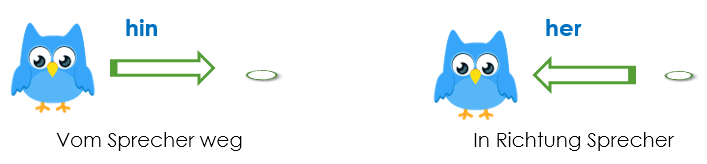

Die Direktionaladverbien geben eine Richtung an: **Wohin? Woher?** *(To where? From where?)*

| Wo? (Dat) | Wohin? (Akk) |
| --------- | ------------ |
| hier      | hierhin      |
| da        | dahin        |
| dort      | dorthin      |
|           | rein         |
|           | raus         |
|           | rauf         |
|           | runter       |
|           | rüber        |

